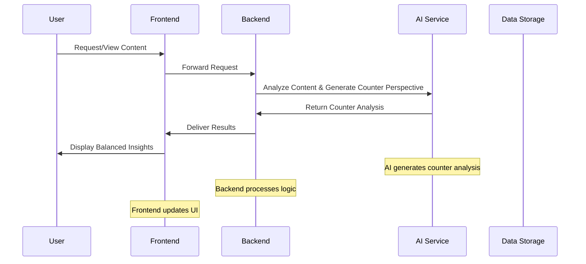
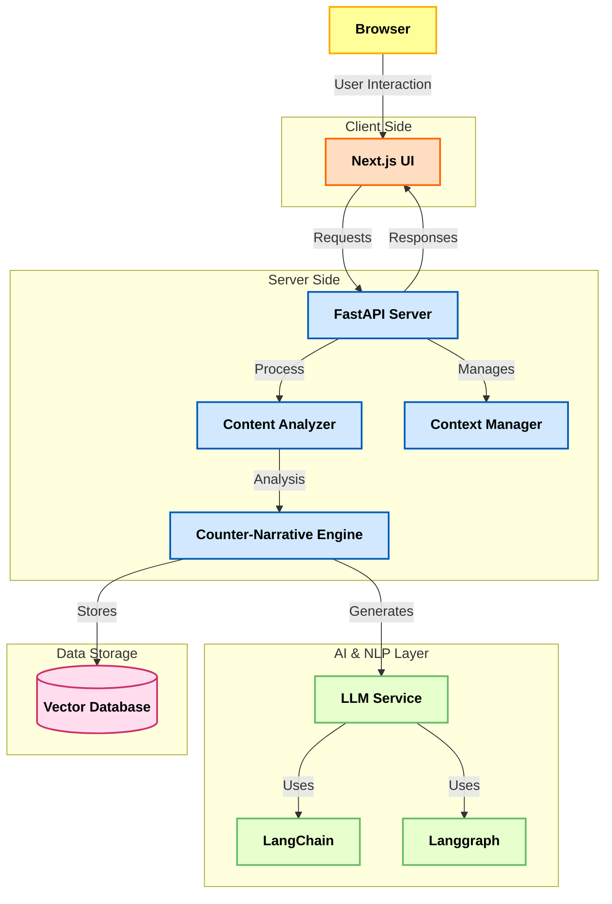

# Perspective-AI

### Table of Contents
- [System Overview](#system-overview)
- [Architecture Components](#architecture-components)
- [Technical Stack](#technical-stack)
- [Core Features](#core-features)
- [Data Flow & Security](#data-flow--security)
- [Setup & Deployment](#setup--deployment)
- [Detailed Architecture Diagram](#detailed-architecture-diagram)
- [Expected Outcomes](#expected-outcomes)
- [Required Skills](#required-skills)

---

## System Overview

Perspective-AI is designed to combat the echo chambers created by personalized content algorithms. It actively curates counterarguments and alternative narratives from credible sources alongside the content you usually see. Whether it’s a news article, blog post, or social media update, Perspective-AI analyzes the existing narrative and presents a balanced, in-depth counter-perspective. This approach not only challenges your current viewpoints but also helps broaden your understanding of complex issues—all in real time.

### High-Level Concept
Imagine having a smart, opinionated friend who isn’t afraid to challenge your beliefs with well-articulated counterpoints—that’s Perspective-AI in a nutshell!

---

## Architecture Components

### 1. Frontend Layer
- **Next.js UI**: A sleek, responsive interface that displays content alongside counter perspectives.

### 3. Core Backend
- **FastAPI Server**: A high-performance API server handling requests, content analysis, and response delivery.
- **Content Analyzer**: Processes incoming articles or posts to identify the dominant narrative.
- **Counter-Narrative Engine**: Uses advanced AI and NLP techniques to generate alternative perspectives and reasoned analyses.

### 4. AI & NLP Integration
- **LLM Service**: Leverages large language models (e.g., OpenAI, custom models) to generate detailed counterarguments.
- **LangChain & Langgraph**: Frameworks to manage chains of reasoning and workflow orchestration for coherent narrative generation.

### 5. Data Storage
- **VectorDB**: A vector database for storing semantic embeddings to efficiently retrieve and compare content.

---

## Technical Stack

### Frontend Technologies
 - **framework**: Next.js
- **styling**: TailwindCSS

### Backend Technologies
  - **framework**: FastAPI
  - **language**: Python
  - **AI & NLP**: LangChain, Langgraph, Prompt Engineering
  - **database**: Any VectorDB


### I Integration

  - **LLM**: OpenAI, Other NLP Models
  - **processing**:Context-Aware


---

## Core Features

### 1. Counter-Perspective Generation
- **What It Does**: Instantly displays counterarguments to the main narrative.
- **How It Works**: Analyzes content to identify biases and generates alternative viewpoints.


### 2. Reasoned Thinking
- **What It Does**: Breaks down narratives into logical, connected arguments.
- **How It Works**: Uses chain-of-thought prompting and connected fact analysis.

### 3. Updated Facts
- **What It Does**: Provides real-time updates and the latest facts along with counter-narratives.
- **How It Works**: Continuously pulls data from trusted sources and updates the insights.

### 4. Seamless Integration
- **What It Does**: Integrates effortlessly with existing news, blogs, and social media platforms.
- **How It Works**: Uses custom integration modules and API endpoints.

### 5. Real-Time Analysis
- **What It Does**: Generates insights instantly as you browse.
- **How It Works**: Employs real-time processing powered by advanced AI.

---

## Data Flow & Security


---

## Setup & Deployment

### Frontend Setup
```bash
cd frontend
npm install
npm run dev
```

### Backend Setup

*Get HuggingFace Access Token:*
- Go to HuggingFace website and create new access token.
- copy that token

*Setup environment variables:*
  - add .env file in `/backend`directory.
  - add following environment variable in your .env file.
  ```
  HF_TOKEN = <Your_hugging_face_access_token>
  ```


```bash
cd backend
python -m app.main
```

---

## Architecture Diagram



---

## Expected Outcomes

- **Less Bias in Narratives**: Break out of echo chambers and question prevailing narratives.
- **Wider Perspectives**: Broaden your understanding of complex issues.
- **Better Discourse**: Enable balanced, informed discussions.
- **Sharper Analysis**: Improve critical thinking by comparing connected facts and counter-facts.

---

## Required Skills

- **Frontend Development**: Experience with Next.js and modern UI frameworks.
- **Backend Development**: Proficiency in Python and FastAPI.
- **AI & NLP**: Familiarity with LangChain, Langgraph, and prompt engineering techniques.
- **Database Management**: Knowledge of vector databases system.

---
